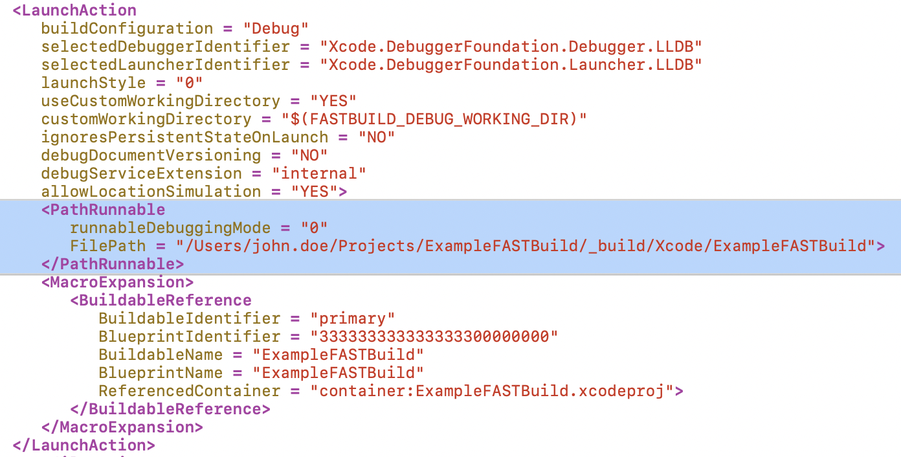

# ExampleFASTBuild

This project provides a practical guide for accelerating C++ compilations using the FASTBuild tool.

## Installation

> **Note:** The steps below are based on FASTBuild version 1.11 as of the time of writing. For the latest version, please refer to the FASTBuild official website.

### MacOS

It's assumed that you've already installed Xcode. The version used in this guide is 14.2 as of writing.

The steps listed below were completed during the setup of this repository to ensure the FASTBuild binaries are ready to use:

- Downloaded the [x64 & ARM](https://www.fastbuild.org/downloads/v1.11/FASTBuild-OSX-x64+ARM-v1.11.zip) binaries from FASTBuild's [Download](https://www.fastbuild.org/docs/download.html) page.
- The zip file was extracted to the `./tools/` directory.
- Ensured the binaries are set as executable:
  ```
  chmod +x ./tools/FASTBuild-OSX-x64+ARM-v1.11/FBuild
  ```
  ```
  chmod +x ./tools/FASTBuild-OSX-x64+ARM-v1.11/FBuildWorker
  ```
- To bypass macOS security warnings for the binaries, these commands were executed:
  ```
  xattr -d com.apple.quarantine ./tools/FASTBuild-OSX-x64+ARM-v1.11/FBuild
  ```
  ```
  xattr -d com.apple.quarantine ./tools/FASTBuild-OSX-x64+ARM-v1.11/FBuildWorker
  ```

### Windows

To do.

## Usage

### MacOS

To generate the Xcode project, simply run the `generateXcode.sh` script located in the root directory. This script automates the process of invoking FASTBuild to generate the Xcode project files.

```
./generateXcode.sh
```

### Windows

To do.

## Limitations

### Run Button in Xcode

After generating the Xcode project, you may notice that hitting the "Run" button in Xcode only builds the project but doesn't actually run the executable. This is due to a limitation in the FASTBuild's Xcode project generation, where the "Run" scheme is not fully configured to specify the executable to run.

#### Workaround

1. Build the project first by selecting `Product -> Build` from the menu.
2. Go to `Product -> Scheme -> Edit Scheme`.
3. In the left sidebar, select `Run` and then go to the `Info` tab.
4. Under `Executable`, select the generated executable file from the dropdown.
5. Press `Close` to save the changes.

Now, the "Run" button should work as expected, building and running your project.

After applying the above workaround, Xcode makes changes (highlighted in blue) to the `.xcscheme` file, which can be visualized as shown below:



If FASTBuild incorporates similar modifications as depicted in the screenshot, it could ensure the "Run" button in Xcode behaves as expected without any workaround.

## References
- https://www.fastbuild.org/
- https://arvid.io/content/static/FASTBuildNotes.pdf
- https://github.com/Leandros/fastbuild-example
- https://github.com/PyrekP/FastBuildTemplate
